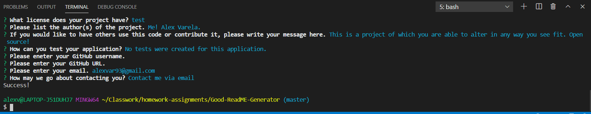

# Good README Generator

See it in action: https://drive.google.com/file/d/1etU3zbZZTPxGU89UX7qsW3GcFnxaFwyB/view

## Description 

This project will prompt the user to input the needed information in order to gereate a concise and well crafted README file for their own project (actually, this is what I used to make my own as well!). Using the Inquirer module from Node, users can put exactly what they want for each section of the README they want to generate, and then the code will create a README.md file in the directory they may use.

Using the markdown I created, it will take the users information and place it in a template literal format.

## Table of Contents 

* [Description](#Description)
* [Installation](#Installation)
* [Usage](#Usage)
* [Credits](#Credits)
* [License](#License)
* [Contributions](#Contributions)
* [Tests](#Tests)
* [Questions](*Questions)

## Installation

In order to install this project you need to have Node already installed on your computer. Then you can access the terminal in Node and run "npm install" in the command prompt. It should then install everything needed to make this work.

## Usage

Type in "node index.js" in the command prompt once you are ready to begin answering questions.

## Credits

Me! Alex Varela.

## License

MIT

## Contributing

This is a project of which you are able to alter in any way you see fit. Open source!

## Tests

No tests were created for this project.

## Questions

Contact me via -

Email: alexvar93@gmail.com

GitHub Profile: https://github.com/Fatmoogle

---
© 2019 Trilogy Education Services, a 2U, Inc. brand. All Rights Reserved.

